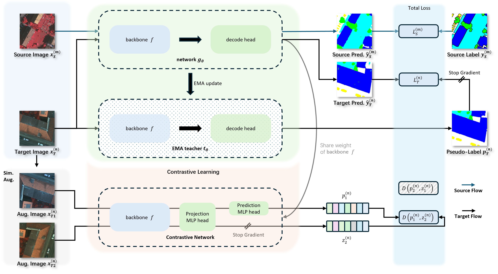
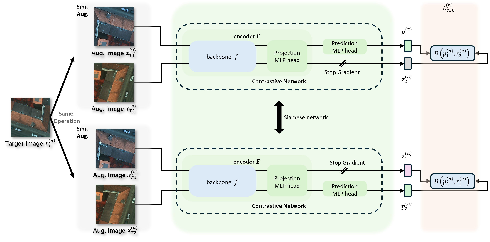

<div align="center">

<h2 style="border-bottom: 1px solid lightgray;">SiamSeg:SimSeg: Self-Training with Contrastive Learning for Unsupervised Domain Adaptation in Remote Sensing</h2>

<div style="display: flex; align-items: center; justify-content: center;">

<p align="center">
  <a href="#">
  <p align="center">
    <a href='https://arxiv.org/pdf/2403.07721'></a>
    
    
  </p>
</p>

</div>

<br/>


<div style="display: flex; align-items: center; justify-content: center;"> Prediction results of our proposed method. </div>



<div style="display: flex; align-items: center; justify-content: center;">
    
    
</div>
<div style="display: flex; align-items: center; justify-content: center;"> Network Architectural and Cross-domain Image Different. </div>


</div>


## News:

---
[//]: # (- [2024/09/26] Our paper is accepted to **NeurIPS 2024**.)

[//]: # (- [2024/09/25] We have updated the [arxiv]&#40;https://arxiv.org/abs/2403.07721&#41; paper.)

[//]: # (- [2024/08/01] Update scripts for training and inference in different tasks.)

[//]: # (- [2024/05/19] Update the dataset loading scripts.)
- [2024/10/16] The [arxiv](https://arxiv.org/abs/2403.07721) paper is available.
- [2024/10/13] Update the code and scripts.


## 1. 创建虚拟环境

---
安装必要的依赖torch=1.10.2,torchvision=0.11.3 和 mmcv-full=1.5.0

推荐使用conda虚拟环境
```shell
conda create -n SiamSeg python==3.8 -y
conda activate SiamSeg 
````
pip 命令安装torch && torchvision && mmcv-full
```shell
pip install torch==1.10.2+cu111 torchvision==0.11.3+cu111 -f https://download.pytorch.org/whl/torch_stable.html 
pip install mmcv-full==1.5.0 -f https://download.openmmlab.com/mmcv/dist/cu111/torch1.10.0/index.html
pip install kornia matplotlib prettytable timm yapf==0.40.1
```
for CN user:
```shell
pip install torch==1.10.2+cu111 -f https://mirror.sjtu.edu.cn/pytorch-wheels/cu111/?mirror_intel_list
pip install torchvision==0.11.3+cu111 -f https://download.pytorch.org/whl/torch_stable.html 
pip install mmcv-full==1.5.0 -f https://download.openmmlab.com/mmcv/dist/cu111/torch1.10.0/index.html
pip install kornia matplotlib prettytable timm yapf==0.40.1
```
安装参考文档refer:
```text
https://blog.csdn.net/shiwanghualuo/article/details/122860521
https://github.com/pytorch/vision#installation
https://mmcv.readthedocs.io/zh-cn/v1.5.0/get_started/installation.html
```


## 2.数据集的准备

---
我们选择 Postsdam, Vaihingen 和 LoveDA 作为基准数据集, 并创建了 train, val, test 列表供研究人员参考.

### 2.1 文件的下载

#### ISPRS Potsdam
The [Potsdam](https://www2.isprs.org/commissions/comm2/wg4/benchmark/2d-sem-label-potsdam/)
dataset is for urban semantic segmentation used in the 2D Semantic Labeling Contest - Potsdam.

The dataset can be requested at the challenge [homepage](https://www2.isprs.org/commissions/comm2/wg4/benchmark/data-request-form/).
The '2_Ortho_RGB.zip', '3_Ortho_IRRG.zip' and '5_Labels_all_noBoundary.zip' are required.

#### ISPRS Vaihingen

The [Vaihingen](https://www2.isprs.org/commissions/comm2/wg4/benchmark/2d-sem-label-vaihingen/)
dataset is for urban semantic segmentation used in the 2D Semantic Labeling Contest - Vaihingen.

The dataset can be requested at the challenge [homepage](https://www2.isprs.org/commissions/comm2/wg4/benchmark/data-request-form/).
The 'ISPRS_semantic_labeling_Vaihingen.zip' and 'ISPRS_semantic_labeling_Vaihingen_ground_truth_eroded_COMPLETE.zip' are required.

#### LoveDA

The data could be downloaded from Google Drive [here](https://drive.google.com/drive/folders/1ibYV0qwn4yuuh068Rnc-w4tPi0U0c-ti?usp=sharing).

Or it can be downloaded from [zenodo](https://zenodo.org/record/5706578#.YZvN7SYRXdF), you should run the following command:

```shell

cd /{your_project_base_path}/SiamSeg/data/LoveDA

# Download Train.zip
wget https://zenodo.org/record/5706578/files/Train.zip
# Download Val.zip
wget https://zenodo.org/record/5706578/files/Val.zip
# Download Test.zip
wget https://zenodo.org/record/5706578/files/Test.zip
```


### 2.2 数据集预处理
将下载的文件放入对应的路径中
格式如下
```text
SiamSeg/
├── data/
│   ├── LoveDA/
│   │   ├── Test.zip
│   │   ├── Train.zip
│   │   └── Val.zip
├── ├── Potsdam_IRRG_DA/
│   │   ├── 3_Ortho_IRRG.zip
│   │   └── 5_Labels_all_noBoundary.zip
├── ├── Potsdam_RGB_DA/
│   │   ├── 2_Ortho_RGB.zip
│   │   └── 5_Labels_all_noBoundary.zip
├── ├── Potsdam_IRRG_DA/
│   │   ├── ISPRS_semantic_labeling_Vaihingen.zip
│   │   └── ISPRS_semantic_labeling_Vaihingen_ground_truth_eroded_COMPLETE.zip


```
- Potsdam
```shell
python tools/convert_datasets/potsdam.py data/Potsdam_IRRG/ --clip_size 512 --stride_size 512
python tools/convert_datasets/potsdam.py data/Potsdam_RGB/ --clip_size 512 --stride_size 512
```
- Vaihingen
```shell
python tools/convert_datasets/vaihingen.py data/Vaihingen_IRRG/ --clip_size 512 --stride_size 256
```
- LoveDA
```shell
cd data/LoveDA
unzip Train.zip, Val.zip, Test.zip
```

## 3.Training 

---
### 3.1 预训练模型的准备

mit_b5.pth :
We provide a script [`mit2mmseg.py`](./tools/model_converters/mit2mmseg.py) in the tools directory to convert the key of models from [the official repo](https://github.com/NVlabs/SegFormer) to MMSegmentation style.
```shell
python tools/model_converters/mit2mmseg.py ${PRETRAIN_PATH} ./pretrained
```
或者可以从 [google drive](https://drive.google.com/drive/folders/1cmKZgU8Ktg-v-jiwldEc6IghxVSNcFqk?usp=sharing) 下载

文件的结构如下
```text
SiamSeg/
├── pretrained/
│   ├── mit_b5.pth (needed)
│   └── ohter.pth  (option)
```


### 3.2 Potsdam IRRG to Vaihingen IRRG
> tips
> 
> 在linux下使用分布式训练脚本时, 由于文件权限的问题, 需要设置下训练脚本的权限
> ```shell
> cd SiamSeg
> chmod 777 ./tools/dist_train.sh
> chmod 777 ./tools/dist_test.sh
> ```


```shell
# Potsdam IRRG to Vaihingen IRRG
# CUDA_VISIBLE_DEVICES 可见的GPU id 是  0-3 总计四个GPU处理器
# PORT 设置分布式训练时master的通信端口
# 最后的4表示使用的GPU总数
CUDA_VISIBLE_DEVICES=0,1,2,3  PORT=10985 \
 ./tools/dist_train.sh \
 configs/SiamSeg/siamseg_daformer_sepaspp_mitb5_512x512_40k_PotsdamIRRG_2_VaihingenIRRG.py 4
```


### 3.3 Potsdam RGB to Vaihingen IRRG

```shell
# Potsdam IRRG to Vaihingen IRRG
# CUDA_VISIBLE_DEVICES 可见的GPU id 是  0-3 总计四个GPU处理器
# PORT 设置分布式训练时master的通信端口
# 最后的4表示使用的GPU总数
CUDA_VISIBLE_DEVICES=0,1,2,3  PORT=10985 \
 ./tools/dist_train.sh \
 configs/SiamSeg/siamseg_daformer_sepaspp_mitb5_512x512_40k_PotsdamRGB_2_VaihingenIRRG.py 4
```
---
### 3.4 Vaihingen IRRG to Potsdam IRRG
```shell
# Potsdam IRRG to Vaihingen IRRG
# CUDA_VISIBLE_DEVICES 可见的GPU id 是  0-3 总计四个GPU处理器
# PORT 设置分布式训练时master的通信端口
# 最后的4表示使用的GPU总数
CUDA_VISIBLE_DEVICES=0,1,2,3  PORT=10985 \
 ./tools/dist_train.sh \
 configs/SiamSeg/siamseg_daformer_sepaspp_mitb5_512x512_40k_VaihingenIRRG_2_PotsdamIRRG.py 4
```

### 3.5 Vaihingen IRRG to Potsdam RGB
```shell
# Potsdam IRRG to Vaihingen IRRG
# CUDA_VISIBLE_DEVICES 可见的GPU id 是  0-3 总计四个GPU处理器
# PORT 设置分布式训练时master的通信端口
# 最后的4表示使用的GPU总数
CUDA_VISIBLE_DEVICES=0,1,2,3  PORT=10985 \
 ./tools/dist_train.sh \
 configs/SiamSeg/siamseg_daformer_sepaspp_mitb5_512x512_40k_VaihingenIRRG_2_PotsdamRGB.py 4
```

### 3.6 LoveDA Rural to Urban
```shell
# Potsdam IRRG to Vaihingen IRRG
# CUDA_VISIBLE_DEVICES 可见的GPU id 是  0-3 总计四个GPU处理器
# PORT 设置分布式训练时master的通信端口
# 最后的4表示使用的GPU总数
CUDA_VISIBLE_DEVICES=0,1,2,3  PORT=10985 \
 ./tools/dist_train.sh \
 configs/SiamSeg/siamseg_daformer_sepaspp_mitb5_512x512_40k_Rural_2_Urban.py 4
```


## 4.Testing

### 4.1 Potsdam IRRG to Vaihingen IRRG
```shell
# for dist test
CUDA_VISIBLE_DEVICES=4,5,6,7  PORT=10985 \
  sh tools/dist_test.sh \
  configs/SiamSeg/siamseg_daformer_sepaspp_mitb5_512x512_40k_PotsdamRGB_2_VaihingenIRRG.py  \
  {beast_model_path}  4 --eval mIoU mFscore

# for predict label save  
# launcher must set to 'none'
# opacity between 0 and 1
PYTHONPATH=$(pwd):$PYTHONPATH  CUDA_VISIBLE_DEVICES=0 \
  python tools/test.py \
  configs/SiamSeg/siamseg_daformer_sepaspp_mitb5_512x512_40k_PotsdamRGB_2_VaihingenIRRG.py  \
  {beast_model_path} --eval mIoU mFscore --launcher none  --opacity 1.0
```


### 4.2 Potsdam RGB to Vaihingen IRRG
```shell
# for dist test
CUDA_VISIBLE_DEVICES=4,5,6,7 PORT=10985 \
  sh tools/dist_test.sh \
  configs/SiamSeg/siamseg_daformer_sepaspp_mitb5_512x512_40k_PotsdamRGB_2_VaihingenIRRG.py  \
  {beast_model_path}  4 --eval mIoU mFscore

# for predict label save  
# launcher must set to 'none'
# opacity between 0 and 1
PYTHONPATH=$(pwd):$PYTHONPATH  CUDA_VISIBLE_DEVICES=0 \
  python tools/test.py \
  configs/SiamSeg/siamseg_daformer_sepaspp_mitb5_512x512_40k_PotsdamRGB_2_VaihingenIRRG.py  \
  {beast_model_path} --eval mIoU mFscore --launcher none  --opacity 1.0
```


### 4.3 Vaihingen IRRG to Potsdam IRRG
```shell
# for dist test
CUDA_VISIBLE_DEVICES=4,5,6,7 PORT=10985 \
  sh tools/dist_test.sh \
  configs/SiamSeg/siamseg_daformer_sepaspp_mitb5_512x512_40k_VaihingenIRRG_2_PotsdamIRRG.py  \
  {beast_model_path}  4 --eval mIoU mFscore
  
# for predict label save  
# launcher must set to 'none'
# opacity between 0 and 1
PYTHONPATH=$(pwd):$PYTHONPATH  CUDA_VISIBLE_DEVICES=0 \
  python tools/test.py \
  configs/SiamSeg/siamseg_daformer_sepaspp_mitb5_512x512_40k_VaihingenIRRG_2_PotsdamIRRG.py  \
  {beast_model_path} --eval mIoU mFscore --launcher none  --opacity 1.0
```


### 4.4 Vaihingen IRRG to Potsdam RGB
```shell
# for dist test
CUDA_VISIBLE_DEVICES=4,5,6,7 PORT=10985 \
  sh tools/dist_test.sh \
  configs/SiamSeg/siamseg_daformer_sepaspp_mitb5_512x512_40k_VaihingenIRRG_2_PotsdamRGB.py  \
  {beast_model_path}  4 --eval mIoU mFscore
# for predict label save

# for predict label save  
# launcher must set to 'none'
# opacity between 0 and 1
PYTHONPATH=$(pwd):$PYTHONPATH  CUDA_VISIBLE_DEVICES=0 \
  python tools/test.py \
  configs/SiamSeg/siamseg_daformer_sepaspp_mitb5_512x512_40k_VaihingenIRRG_2_PotsdamRGB.py  \
  {beast_model_path} --eval mIoU mFscore --launcher none  --opacity 1.0
```


### 4.5 LoveDA Rural to Urban
```shell
# for dist test
CUDA_VISIBLE_DEVICES=4,5,6,7 PORT=10985 \
  sh tools/dist_test.sh \
  configs/SiamSeg/siamseg_daformer_sepaspp_mitb5_512x512_40k_Rural_2_Urban.py  \
  {beast_model_path}  4 --eval mIoU mFscore

# for predict label save  
# launcher must set to 'none'
# opacity between 0 and 1
PYTHONPATH=$(pwd):$PYTHONPATH  CUDA_VISIBLE_DEVICES=0 \
  python tools/test.py \
  configs/SiamSeg/siamseg_daformer_sepaspp_mitb5_512x512_40k_Rural_2_Urban.py  \
  {beast_model_path} --eval mIoU mFscore --launcher none  --opacity 1.0
```


# References

---
Many thanks to their excellent works
* [MMSegmentation](https://github.com/open-mmlab/mmsegmentation)
* [DACS](https://github.com/vikolss/DACS)
* [DAFormer](https://github.com/lhoyer/DAFormer)